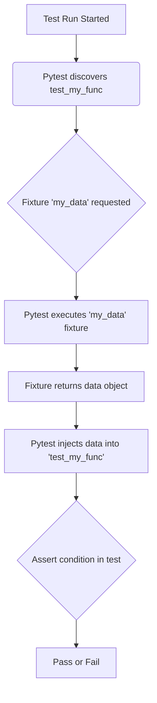

> [!INFO]
> **Executive Summary:** Pytest is a mature, feature-rich testing framework for Python. It makes it easy to write small, readable tests, and scales to support complex functional testing for applications and libraries.

## Core Concepts

Pytest is designed for simplicity and scalability. Its main features include automatic test discovery, a powerful fixture model, and simple `assert` statements that provide detailed introspection on failure.

### Test Discovery
By default, `pytest` searches for files named `test_*.py` or `*_test.py`. Within those files, it looks for functions prefixed with `test_`. This convention-over-configuration approach removes the need for explicit test registration.

### Simple Assertions
Pytest allows you to use standard Python `assert` statements for checking outcomes. When an assertion fails, `pytest` provides a detailed report on the values involved, making it easy to diagnose the issue without boilerplate code.

### Fixtures
**Fixtures** are functions that provide a fixed baseline state or data for tests. They are `pytest`'s dependency injection system, allowing you to set up resources (like database connections, temporary files, or input data) and tear them down cleanly after the test runs. A test function can receive a fixture by declaring it as an argument.

## Code Examples

### Basic Test Function
A simple test function that checks for a successful outcome.

```python
# content of test_example.py
def test_addition():
    """Tests a simple addition operation."""
    result = 1 + 1
    assert result == 2

def test_subtraction_fails():
    """This test is designed to fail to show output."""
    result = 5 - 3
    assert result == 1 # This will fail
```

### Using Fixtures
Fixtures are ideal for setting up reusable test contexts.

```python
# content of test_app.py
import pytest

@pytest.fixture
def sample_data():
    """Provides a sample list for tests."""
    return [10, 20, 30]

def test_list_length(sample_data):
    """Uses a fixture to test the length of a list."""
    assert len(sample_data) == 3

def test_list_sum(sample_data):
    """Uses the same fixture to test the sum."""
    assert sum(sample_data) == 60
```

## Visual Representation

This diagram illustrates how a test function uses a fixture to get data and then asserts a condition.



## Related Concepts
- [[Python]]
- [[Design Patterns]]
- [[DevOps]]
- [[Docker]]
- [[Jenkins]]
